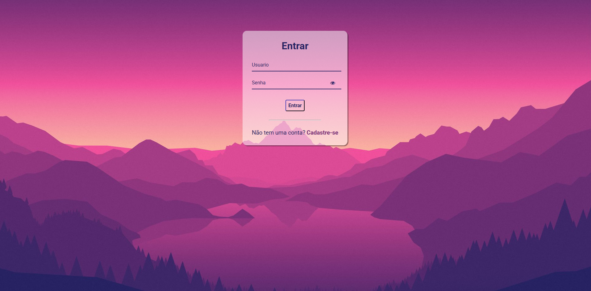

# LOGIN

Este é um projeto simples de Login feito com HTML, CSS e JavaScript, Após logado ele te redireciona para outro site!

<p align="center">
  
</p>

## 🖼️ Preview



## 🔍 Funcionalidades

- Logar ou Cadastrar um usuário
- Após logar ser redirecionado para um novo site
- Interface de cadastro
- Banco de dados do navegador
- Interface estilizada com visual mais animado

## 🧑‍💻 Tecnologias Utilizadas

- HTML5
- CSS3
- JavaScript (ES6)


## 📁 Estrutura de Arquivos
- index.html - Página principal
- css/style.css - Estilos do projeto
- js/script.js - Lógica de interação 
- images - Imagem da Tela De Login


## ▶️ Como Usar

1. Clone o repositório:
   ```bash
   git clone https://tamborim13.github.io/Projeto-Login/

Feito com ♥ by  Giovanni Tamborim 